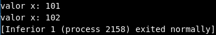
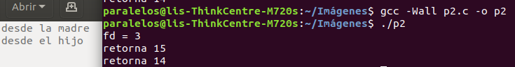
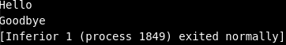
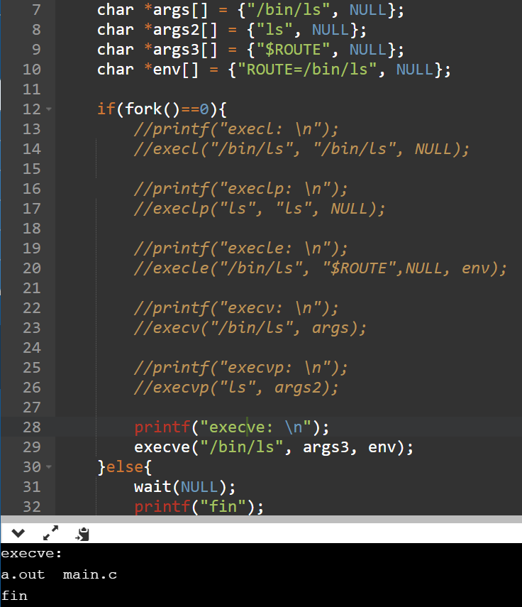
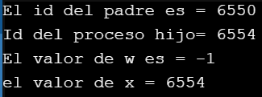
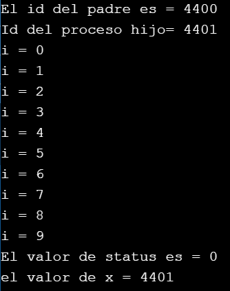
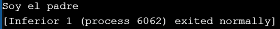
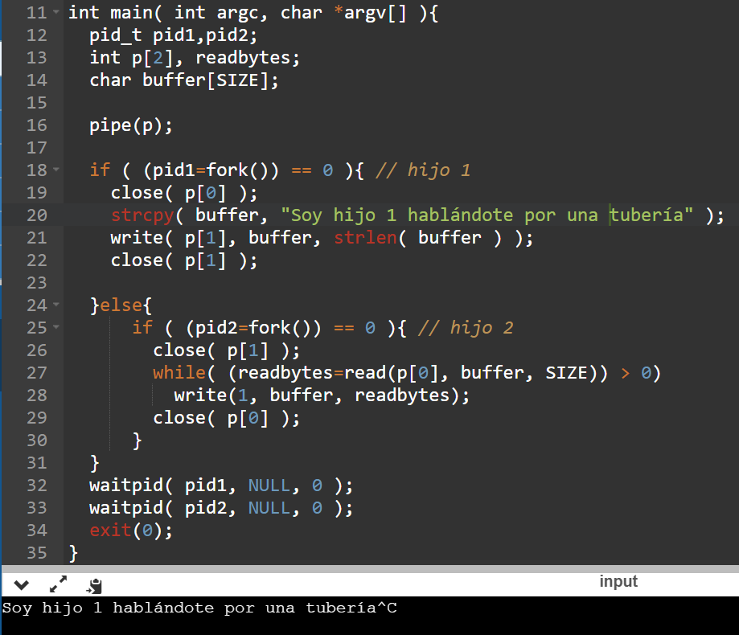

# PRÁCTICA 1 - PROCESOS #

## 1. Objetivos ##
1. Familiarizarse con las diferentes estructuras y funciones relacionadas con el manejo de procesos en linux.
2. Codificar programas que hagan uso del API de procesos.

## 2. Actividades en el laboratorio ##

Realizar los siguientes ejercicios:

1. Escriba un programa que llame un ```fork()```. Antes del llamado del ```fork()```, declare una variable de acceso (por ejemplo, ```x```) y asígnele un valor (por ejemplo, ```100```). Responda las siguientes preguntas:
  * ¿Cuál es el valor de la variable en el proceso hijo?
  * ¿Qué sucede con la variable cuando el proceso hijo y el padre cambian el valor de ```x```?
   
```C
#include <stdio.h>
#include <unistd.h>

int main(){
    int x = 100;
    if(fork()==0){
        x+=1;
    }else{
        x+=2;
    }
    printf("valor x: %d",x);
    return 0;
}
```

```
-la variable x es igual a 100 en el proceso hijo.
-se crean dos instancias de la variable, una para el proceso hijo y una para el padre, ambas se modifican independientemente.
```  
2. Escriba un programa que abra un archivo (con la llamada ```open()```) y entonces llame a ```fork()```. **Nota**: El siguiente [enlace](https://www.geeksforgeeks.org/input-output-system-calls-c-create-open-close-read-write/) puede ser de utilidad para entender la llamada ```open()```.
  * ¿Pueden el padre y el hijo acceder al file descriptor retornado por ```open()```? 
  * ¿Qué pasa si ellos empiezan a escribir el archivo de manera concurrente, es decir, a la misma vez?
```C  
#include<stdio.h> 
#include<fcntl.h> 
#include<errno.h> 
#include<string.h> 
#include<unistd.h>

extern int errno; 
int main() {      
    int sz; 
    int fd = open("foo.txt", O_WRONLY | O_CREAT);  
    printf("fd = %d\n", fd); 
    if(fork()==0){
        sz = write(fd, "desde el hijo\n", strlen("desde el hijo\n")); 
    }else{
        sz = write(fd, "desde la madre\n", strlen("desde la madre\n")); 
    }
    printf("retorna %d\n", sz); 
    close(fd); 
    return 0; 
} 
```   

```  
-Sí, ambos pueden acceder al file descriptor.
-Los dos escriben en el archivo.
```
3. Escriba un programa usando ```fork()```. El proceso hijo imprimirá ```"Hello"```; el proceso padre imprimirá ```"goodbye"```. Usted deberá asegurar que el proceso hijo imprima en primer lugar; ¿usted podría hacer esto sin llamar ```wait()``` en el padre? 
```C
#include <stdio.h>
#include <unistd.h>

int main()
{
    if(fork()==0){
        printf("Hello\n");
    }else{
        sleep(1);
        printf("Goodbye\n");
    }
    return 0;
}

```

```  
-Sí, se puede dando un sleep al proceso padre tal que de tiempo al hijo para terminar su ejecución.
```
4. Escriba un programa que llame ```fork()``` y entonces llame alguna forma de ```exec()``` para correr el programa ```/bin/ls```. Intente probar todas las variaciones de la familia de funciones ```exec()``` incluyendo (en linux) ```execl()```, ```execle()```, ```execlp()```, ```execv()```, ```execvp()``` y ```execvpe()```. ¿Por qué piensa usted que existen tantas variaciones para la misma llamada básica?
```C
#include <unistd.h>
#include <stdio.h>
#include <stdlib.h>
#include <sys/wait.h> 

int main(int argc, char *argv[]) {
	char *args[] = {"/bin/ls", NULL};
    char *args2[] = {"ls", NULL};
    char *args3[] = {"$ROUTE", NULL};
    char *env[] = {"ROUTE=/bin/ls", NULL};

	if(fork()==0){
	    //printf("execl: \n");
        //execl("/bin/ls", "/bin/ls", NULL);
        
	    //printf("execlp: \n");
        //execlp("ls", "ls", NULL);
        
        //printf("execle: \n");
        //execle("/bin/ls", "$ROUTE",NULL, env);
        
        //printf("execv: \n");
        //execv("/bin/ls", args);
       
        //printf("execvp: \n");
        //execvp("ls", args2);
       
        printf("execve: \n");
        execve("/bin/ls", args3, env);
    }else{
        wait(NULL);
        printf("fin");
    }                
	return 0;
}
```

```  
-Para dar flexibildad en la forma en la que se pasan los parámetros del programa a ejecutar y para ofrecer la posibilidad de usar variables de entorno propias.
```
5. Escriba ahora un programa que use ```wait()``` para esperar que el proceso hijo finalice su ejecución. ¿Cuál es el valor de retorno de la función ```wait()```?, ¿Qué pasa si usted usa la función ```wait``` en el hijo?
```C
#include<stdio.h> 
#include<unistd.h>
#include <stdlib.h>


int main(){
    pid_t pid;
    printf("El id del padre es = %d\n", getpid());
    pid = fork();
    if(pid == 0){
        printf("Id del proceso hijo= %d\n", getpid());
        int w = wait(NULL);
        printf("El valor de w es = %d\n", w);
    }else{
        int x = wait(NULL);
        printf("el valor de x = %d\n", x);
    }
    
    return 0;
}
```

```  
-La función wait retorna la ID del proceso hijo.
Si la función wait() es usada dentro de un proceso que no tiene hijos retornará -1.
```
6. Haga un programa, como el del ejercicio anterior, con una breve modificación, la cual consiste en usar ```waitpid()``` en lugar de ```wait()```. ¿Cuándo podría ser ```waitpid()``` útil?
```C
#include<stdio.h> 
#include<unistd.h>
#include <stdlib.h>

int main(){
    pid_t pid;
    int status;

    printf("El id del padre es = %d\n", getpid());
    pid = fork();
    if(pid == 0){
        printf("Id del proceso hijo= %d\n", getpid());
        for(int i = 0; i < 10; i++){
            printf("i = %d\n", i);
        }  
    }else{
        int x = waitpid(pid, &status, 0);
        printf("El valor de status es = %d\n", status);
        printf("el valor de x = %d\n", x);
    }
    
    return 0;
}
```

```  
-Resultaría de utilidad en situaciones en las que no se necesita esperar a todos los procesos hijos sino a uno solo.
```
7. Escriba un programa que cree un proceso hijo y entonces en el proceso hijo cierre la salida estandar (```STDOUT FILENO```). ¿Qué pasa si el hijo llama ```printf()``` para imprimir alguna salida después de cerrar el descriptor?
```C
#include<stdio.h>
#include<unistd.h>

int main(){
    
    if(fork() == 0){
        close(STDOUT_FILENO);
        printf("Soy el hijo\n");
    }else{
        printf("Soy el padre\n");
    }
    return 0;
}
```

```  
-Cuando el hijo intentar usar la funcion printf() después de usar el descriptor no sucede nada, es decir no imprime nada.
```
8. Escriba un programa que cree dos hijos y conecte la salida estándar de un hijo a la entrada estándar del otro usando la llamada a sistema ```pipe()```
```C
#include <sys/types.h>
#include <fcntl.h>
#include <unistd.h>
#include <stdio.h>
#include <stdlib.h>
#include <string.h>
#include <sys/wait.h> 

#define SIZE 512
 
int main( int argc, char *argv[] ){
  pid_t pid1,pid2;
  int p[2], readbytes;
  char buffer[SIZE];
 
  pipe(p);
 
  if ( (pid1=fork()) == 0 ){ // hijo 1
    close( p[0] ); 
    strcpy( buffer, "Soy hijo 1 hablándote por una tubería" );
    write( p[1], buffer, strlen( buffer ) );
    close( p[1] );
    
  }else{
      if ( (pid2=fork()) == 0 ){ // hijo 2
        close( p[1] );
        while( (readbytes=read(p[0], buffer, SIZE)) > 0)
          write(1, buffer, readbytes);
        close( p[0] );
      } 
  }
  waitpid( pid1, NULL, 0 );
  waitpid( pid2, NULL, 0 );
  exit(0);
}
```


## 3. Entregable ##

Los entregables para esta practica incluiran:
1. Codigo de los ejercicos propuestos.
2. Solución a las preguntas planteadas. apoyar la explicación con graficas donde lo vea necesario.
